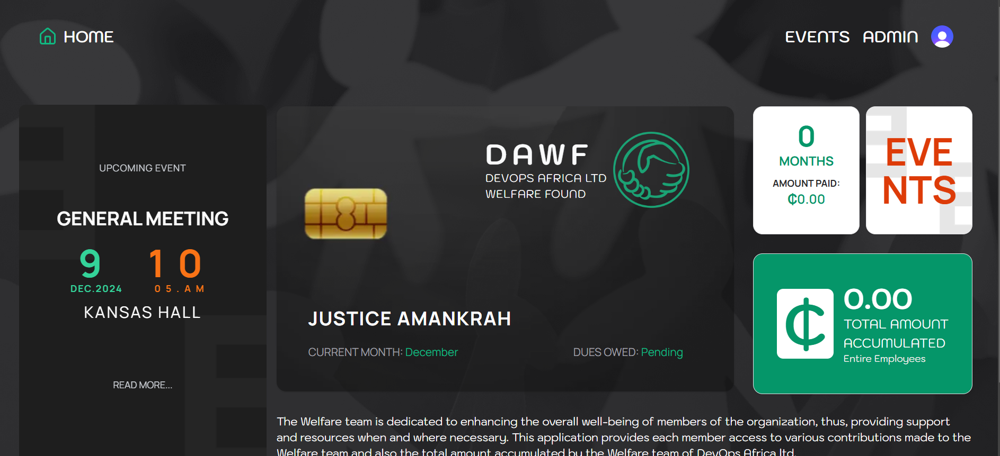

# DAWF - DevOps Africa Welfare Fund

> A comprehensive welfare management system for employee contributions, events, expenses, and benefits tracking.



[](https://nextjs.org/)
[](https://react.dev/)
[](https://www.typescriptlang.org/)
[](https://www.prisma.io/)
[](https://tailwindcss.com/)

## Overview

DAWF is a modern, full-stack web application built to manage employee welfare contributions, track expenses, organize events, and automate notifications. Designed specifically for DevOps Africa Limited, it streamlines welfare fund management with powerful automation and analytics.

## ✨ Key Features

### Financial Management
- 📊 **Contribution Tracking** - Monitor employee monthly contributions (GH₵100 default)
- 💰 **Expense Management** - Track welfare expenses across categories (Birthday, Funeral, Marriage, Childbirth, etc.)
- 📈 **Analytics Dashboard** - Real-time insights into fund performance
- 📑 **Reports & Export** - Generate and export financial reports to Excel
- 💸 **Disbursements View** - Employees can view all benefits received

### Event Management
- 📅 **Event Calendar** - FullCalendar integration for visual event management
- 🎂 **Automated Birthday Events** - Auto-generate birthday events annually
- 🎉 **Event Types** - Support for birthdays, weddings, childbirth, funerals, and custom events
- 🔔 **Event Notifications** - Automatic email reminders 3 days before events

### Automation
- 🤖 **Monthly Contributions** - Auto-create contributions at month-end
- 📧 **Email Notifications** - 6 beautiful HTML email templates
- 🎂 **Birthday Wishes** - Automatic daily birthday emails
- 📅 **Event Reminders** - Automated event notifications
- ⏰ **Cron Jobs** - Scheduled tasks via Vercel Cron

### User Management
- 🔐 **Google OAuth** - Secure authentication with domain restriction
- 👥 **Role-Based Access** - ADMIN and EMPLOYEE roles
- 👤 **User Profiles** - Profile management with birthday tracking
- 🎂 **Upcoming Birthdays Widget** - See next 7 days of birthdays

### Analytics & Reporting
- 📊 **Financial Summary** - Total contributions, expenses, and fund balance
- 📈 **Trends Analysis** - Monthly and quarterly comparisons
- 💳 **Contribution by Employee** - Detailed breakdowns
- 📉 **Expense by Type** - Category-wise expense analysis
- 📄 **Excel Export** - Professional report generation

## 🚀 Quick Start

### Prerequisites

- **Node.js** 20+ and npm
- **PostgreSQL** database (Neon, Supabase, or Railway)
- **Google Cloud Console** project (for OAuth)
- **Resend** account (for emails)

### Installation

1. **Clone the repository**
   ```bash
   git clone https://github.com/your-org/dwarf.git
   cd dwarf
   ```

2. **Install dependencies**
   ```bash
   npm install
   ```

3. **Set up environment variables**
   ```bash
   cp .env.example .env
   ```

   Fill in your environment variables:
   ```env
   # Database
   DATABASE_URL="postgresql://..."
   DATABASE_URL_UNPOOLED="postgresql://..."

   # Authentication
   BETTER_AUTH_SECRET="your-secret"
   BETTER_AUTH_URL="http://localhost:3000"
   NEXT_PUBLIC_BETTER_AUTH_URL="http://localhost:3000"

   # Google OAuth
   GOOGLE_CLIENT_ID="your-client-id"
   GOOGLE_CLIENT_SECRET="your-secret"

   # Email
   RESEND_API_KEY="re_..."
   FROM_EMAIL="noreply@yourdomain.com"

   # Cron Security
   CRON_SECRET="your-secret"
   ```

4. **Set up the database**
   ```bash
   npm run db:push
   ```

5. **Run the development server**
   ```bash
   npm run dev
   ```

6. **Open your browser**
   Visit [http://localhost:3000](http://localhost:3000)

## 📦 Tech Stack

### Core
- **Framework**: Next.js 15.0.3 (App Router)
- **UI Library**: React 19 (RC)
- **Language**: TypeScript 5
- **Styling**: Tailwind CSS 3.4.1

### Backend & Database
- **ORM**: Prisma 6.0.1
- **Database**: PostgreSQL
- **Authentication**: Better-Auth 1.0.15
- **Email Service**: Resend 6.2.1

### UI Components
- **Component Library**: Radix UI
- **Calendar**: FullCalendar 6.1.15
- **Charts**: Recharts 2.14.1
- **Icons**: Lucide React 0.462.0
- **Forms**: React Hook Form 7.53.2
- **Validation**: Zod 3.23.8

### Data & Export
- **Excel Export**: ExcelJS 4.4.0
- **Date Utils**: Date-fns 4.1.0, Moment.js 2.30.1

## 📁 Project Structure

```
dwarf/
├── app/                          # Next.js App Router
│   ├── (admin)/                  # Admin routes
│   │   └── admin/
│   │       ├── contribution/     # Contribution management
│   │       ├── expenses/         # Expense management
│   │       ├── events/           # Event management
│   │       ├── analytics/        # Analytics dashboard
│   │       └── reports/          # Reports generation
│   ├── (auth)/                   # Authentication routes
│   │   ├── sign-in/
│   │   ├── sign-up/
│   │   └── complete-profile/
│   ├── (root)/                   # Employee routes
│   │   ├── page.tsx              # Dashboard
│   │   ├── events/               # Events calendar
│   │   └── disbursements/        # Benefits view
│   └── api/                      # API routes
│       ├── auth/                 # Better-Auth endpoints
│       ├── cron/                 # Automated tasks
│       └── birthdays/            # Birthday APIs
├── components/
│   ├── admin/                    # Admin components
│   ├── auth/                     # Auth components
│   ├── shared/                   # Shared components
│   └── ui/                       # UI primitives
├── lib/
│   ├── actions/                  # Server actions
│   ├── auth.ts                   # Auth configuration
│   ├── auth-client.ts            # Client auth
│   ├── email.ts                  # Email functions
│   ├── email-templates.ts        # Email HTML templates
│   ├── prisma.ts                 # Prisma client
│   ├── utils.ts                  # Utilities
│   └── validation.ts             # Zod schemas
├── prisma/
│   ├── schema.prisma             # Database schema
│   └── migrations/               # Database migrations
├── public/                       # Static assets
├── .env.example                  # Environment template
├── vercel.json                   # Cron configuration
├── next.config.ts                # Next.js config
├── tailwind.config.ts            # Tailwind config
├── middleware.ts                 # Auth middleware
└── package.json                  # Dependencies
```

## 🗄️ Database Schema

### Core Models
- **User** - Employee information, authentication, and profile
- **Contribution** - Monthly welfare contributions
- **Event** - Welfare events (birthdays, weddings, etc.)
- **Expense** - Welfare fund expenses and disbursements
- **Session** - User sessions (Better-Auth)
- **Account** - OAuth accounts (Better-Auth)

### Key Features
- Indexed queries for performance
- Quarterly aggregations
- Automatic timestamp tracking
- Cascade deletions for referential integrity

## 🔐 Authentication & Authorization

### Authentication Methods
- **Google OAuth**: Restricted to `@devopsafricalimited.com` emails
- **Email/Password**: Optional local authentication

### User Roles
- **ADMIN**: Full system access (contributions, expenses, events, analytics, reports)
- **EMPLOYEE**: Dashboard, events calendar, personal disbursements

### Security Features
- Server-side session validation
- Domain-based OAuth restriction
- CRON_SECRET for API security
- Security headers (X-Frame-Options, CSP, etc.)
- Input validation with Zod
- SQL injection protection (Prisma ORM)

## 📧 Email System

### Templates
1. **Birthday Wish** - Sent to birthday celebrant
2. **Childbirth Congratulations** - Sent to new parent
3. **Childbirth Announcement** - Sent to all employees
4. **Marriage Congratulations** - Sent to married employee
5. **Marriage Announcement** - Sent to all employees
6. **Upcoming Event** - Sent 3 days before events

### Features
- HTML formatted with company branding
- Mobile-responsive design
- Automated sending via cron jobs
- Resend API integration

## ⏰ Automated Tasks (Cron Jobs)

| Task | Schedule | Purpose |
|------|----------|---------|
| **Daily Notifications** | Every day at 8 AM | Send birthday wishes & event reminders |
| **Monthly Contributions** | Last day of month, 11:59 PM | Auto-create GH₵100 contributions |
| **Birthday Events** | January 1st, midnight | Generate birthday events for new year |

### Manual Triggering
```bash
# Send notifications
curl -X GET "https://your-app.com/api/cron/send-notifications" \
  -H "Authorization: Bearer YOUR_CRON_SECRET"

# Create monthly contributions
curl -X GET "https://your-app.com/api/cron/monthly-contributions" \
  -H "Authorization: Bearer YOUR_CRON_SECRET"

# Generate birthday events
curl -X GET "https://your-app.com/api/cron/birthday-events?year=2025" \
  -H "Authorization: Bearer YOUR_CRON_SECRET"
```

## 🎨 Key Pages

### For Employees
- **Dashboard** (`/`) - Personal stats, upcoming events, birthdays
- **Events Calendar** (`/events`) - View all welfare events
- **Disbursements** (`/disbursements`) - View benefits received

### For Admins
- **Admin Dashboard** (`/admin`) - Overview and quick actions
- **Contributions** (`/admin/contribution`) - Manage contributions
- **Expenses** (`/admin/expenses`) - Track expenses
- **Events** (`/admin/events`) - Manage events
- **Analytics** (`/admin/analytics`) - Financial insights
- **Reports** (`/admin/reports`) - Generate and export reports
- **Employees** (`/admin/employees`) - View employee list

## 🚢 Deployment

### Deploy to Vercel (Recommended)

1. **Push to GitHub**
   ```bash
   git push origin master
   ```

2. **Import to Vercel**
   - Go to https://vercel.com/new
   - Import your repository
   - Add environment variables from `.env.example`
   - Deploy

3. **Post-Deployment**
   - Verify cron jobs are configured
   - Create first admin user
   - Generate birthday events

### Environment Variables
See [.env.example](.env.example) for all required variables.

### Alternative Platforms
Compatible with:
- Railway
- Render
- DigitalOcean App Platform
- AWS Amplify
- Google Cloud Run

## 📝 Scripts

```bash
# Development
npm run dev              # Start dev server
npm run dev:turbo        # Start with Turbopack

# Production
npm run build            # Build for production
npm run start            # Start production server
npm run build:production # Full build with checks

# Quality
npm run lint             # Run ESLint
npm run type-check       # TypeScript validation

# Database
npm run db:push          # Push schema changes
npm run db:migrate       # Run migrations
npm run db:studio        # Open Prisma Studio
```

## 🤝 Contributing

1. Fork the repository
2. Create a feature branch (`git checkout -b feature/amazing-feature`)
3. Commit your changes (`git commit -m 'Add amazing feature'`)
4. Push to the branch (`git push origin feature/amazing-feature`)
5. Open a Pull Request

### Development Guidelines
- Follow TypeScript best practices
- Use ESLint and Prettier
- Write meaningful commit messages
- Update documentation as needed
- Test on multiple screen sizes

## 🐛 Troubleshooting

### Common Issues

**OAuth Redirect Error**
- Verify redirect URI in Google Cloud Console matches your domain exactly

**Database Connection Issues**
- Ensure `DATABASE_URL` includes `?pgbouncer=true` for connection pooling
- Check database is accessible from your IP/Vercel

**Emails Not Sending**
- Verify domain in Resend dashboard
- Check DNS records are correctly configured
- Confirm `FROM_EMAIL` matches verified domain

**Cron Jobs Not Running**
- Ensure `vercel.json` is in root directory
- Verify `CRON_SECRET` is set in environment variables
- Check Vercel function logs for errors

## 📊 System Requirements

### Minimum
- **Node.js**: 18+
- **Database**: PostgreSQL 12+
- **Memory**: 512MB RAM
- **Storage**: 1GB

### Recommended
- **Node.js**: 20+
- **Database**: PostgreSQL 15+
- **Memory**: 1GB RAM
- **Storage**: 5GB

## 🔒 Security

- Domain-restricted OAuth (`@devopsafricalimited.com` only)
- Server-side session validation
- API route protection with CRON_SECRET
- Input validation with Zod
- SQL injection protection via Prisma ORM
- XSS protection headers
- HTTPS enforced in production

## 📄 License

This project is proprietary software developed for DevOps Africa Limited.

## 👥 Team

Developed for DevOps Africa Limited by the internal development team.

## 📞 Support

For issues and questions:
- **GitHub Issues**: [Create an issue](https://github.com/your-org/dwarf/issues)
- **Email**: support@devopsafricalimited.com
- **Documentation**: Check the `/docs` folder

## 🎯 Roadmap

### Completed ✅
- [x] Google OAuth with domain restriction
- [x] Contribution tracking and automation
- [x] Event management with calendar
- [x] Email notifications
- [x] Analytics dashboard
- [x] Excel report export
- [x] Automated cron jobs
- [x] Birthday automation
- [x] Disbursements view

### Planned 🚧
- [ ] PDF report export
- [ ] SMS notifications
- [ ] Mobile app
- [ ] Bulk user import (CSV)
- [ ] Document attachments
- [ ] Payment gateway integration
- [ ] Multi-currency support
- [ ] In-app notifications
- [ ] Advanced analytics

## 🙏 Acknowledgments

- **Next.js Team** - For the amazing framework
- **Vercel** - For hosting and cron jobs
- **Prisma Team** - For the excellent ORM
- **Better-Auth** - For authentication
- **Resend** - For email service
- **Radix UI** - For accessible components

---

<div align="center">

**Built with ❤️ for DevOps Africa Limited**

[Documentation](./DEPLOYMENT_GUIDE.md) • [Features](./FEATURES_SUMMARY.md) • [Deployment](./DEPLOYMENT_READY.md)

</div>
